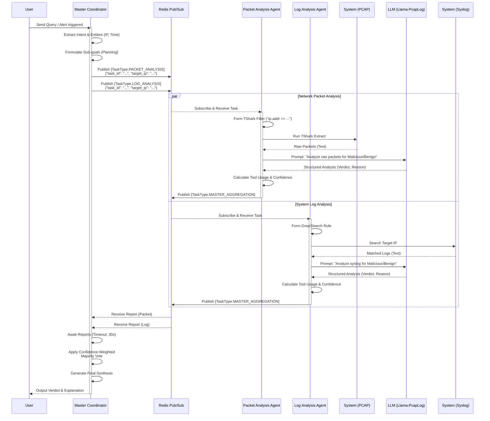

# CMAF System Control Flow

This document illustrates the detailed control flow of the Collaborative Multi-Agent Framework (CMAF) during a security analysis task, directly addressing reproducibility and architectural specifics.

## Detailed Control Flow Diagram

### Key Mechanisms:
1. **Asynchronous Parallelism**: The `Master Coordinator` distributes tasks to specialized agents concurrently via `Redis Pub/Sub`.
2. **Contextual Tool Execution**: Each agent executes domain-specific tools (`tshark` for packets, `grep` for system logs) autonomously based on the Master's target IP.
3. **Local LLM Inference**: Information extraction and semantic analysis are processed locally at the edge using the fine-tuned `Llama-PcapLog` model, minimizing raw data transmission to the Master.
4. **Resilient Aggregation**: The Master collects structured `AgentIntelligence` reports and derives the final verdict using a Confidence-Weighted Majority Vote, neutralizing erroneous or low-confidence edge agents (benign hallucinations).
